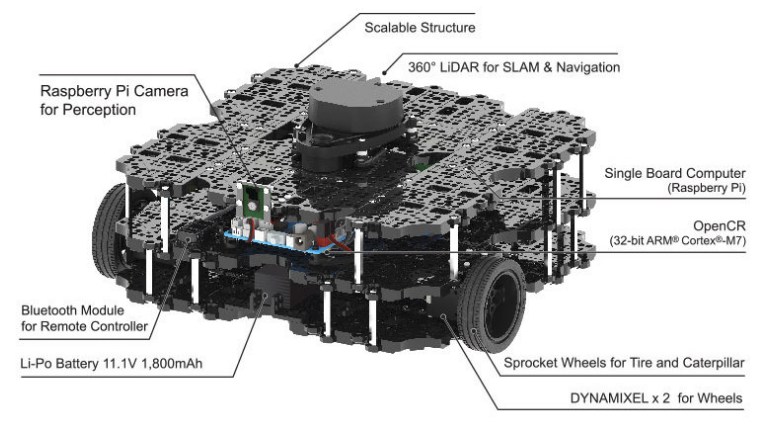
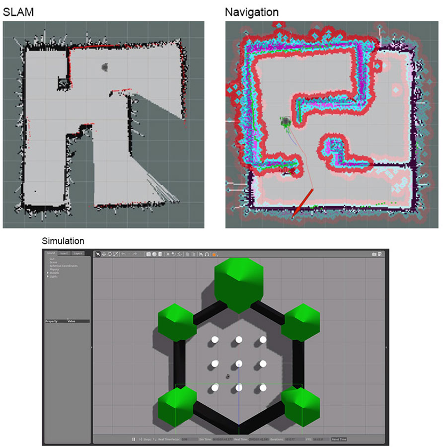
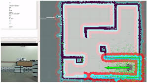

## Turtlebot3 WafflePi Quick Setup

 This quick setup guide gets you up and running with the Turtlebot3 WafflePi in no time! This is only a quick setup guide, see the official tutorials [here](http://emanual.robotis.com/docs/en/platform/turtlebot3/overview/#overview) for more detailed instructions. 

<table><tr>
    <td><div style="width:image width px; font-size:80%; text-align:center;">
</div></td>
    <td><div style="width:image width px; font-size:80%; text-align:center;">

        </div></td>
    </tr></table>


## Requirements

- Turtlebot3 WafflePi ([assembled](http://emanual.robotis.com/docs/en/platform/turtlebot3/hardware_setup/#assembly-manual))

- [Ubuntu 16.04 Xenial](http://releases.ubuntu.com/16.04/) (Remote PC and RPi3)

- [ROS Kinetic](http://wiki.ros.org/kinetic/Installation/Ubuntu) (Remote PC and RPi3)


## Quick Setup

1. [Remote PC Setup](#1-remote-pc-setup)

2. [Turtlebot3 WafflePi Setup](#2-turtlebot3-wafflepi-setup)

3. [SLAM Setup](#3-slam-setup)

4. [Navigation Stack Setup](#4-navigation-stack-setup)

5. [Simulation Setup](#5-simulation-setup)


### 1. Remote PC Setup

[Install](http://wiki.ros.org/kinetic/Installation/Ubuntu) ROS Kinetic on Remote PC

```bash
$ sudo apt-get update
$ sudo apt-get upgrade
$ sudo sh -c 'echo "deb http://packages.ros.org/ros/ubuntu $(lsb_release -sc) main" > /etc/apt/sources.list.d/ros-latest.list'
$ sudo apt-key adv --keyserver hkp://ha.pool.sks-keyservers.net:80 --recv-key 421C365BD9FF1F717815A3895523BAEEB01FA116
$ sudo apt-get update
$ sudo apt-get install ros-kinetic-desktop-full
$ sudo rosdep init
$ rosdep update
$ echo "source /opt/ros/kinetic/setup.bash" >> ~/.bashrc
$ source ~/.bashrc
$ sudo apt-get install python-rosinstall python-rosinstall-generator python-wstool build-essential
```

[Configure](http://wiki.ros.org/ROS/Tutorials/InstallingandConfiguringROSEnvironment) your ROS environment

```bash
$ mkdir -p ~/catkin_ws/src
$ cd ~/catkin_ws/ && catkin_make
$ echo "source ~/catkin_ws/devel/setup.bash" >> ~/.bashrc
$ source ~/.bashrc
```

Confirm the installation and configuration of ROS. You should see the following output.

```bash
$ printenv | grep ROS
ROS_ROOT=/opt/ros/kinetic/share/ros
ROS_PACKAGE_PATH=/home/<username>/catkin_ws/src:/opt/ros/kinetic/share
ROS_MASTER_URI=http://localhost:11311
ROS_VERSION=1
ROSLISP_PACKAGE_DIRECTORIES=/home/ubuntu/catkin_ws/devel/share/common-lisp
ROS_DISTRO=kinetic
ROS_ETC_DIR=/opt/ros/kinetic/etc/ros
```

Install dependent ROS Packages

```bash
$ sudo apt-get install ros-kinetic-joy ros-kinetic-teleop-twist-joy ros-kinetic-teleop-twist-keyboard ros-kinetic-laser-proc ros-kinetic-rgbd-launch ros-kinetic-depthimage-to-laserscan ros-kinetic-rosserial-arduino ros-kinetic-rosserial-python ros-kinetic-rosserial-server ros-kinetic-rosserial-client ros-kinetic-rosserial-msgs ros-kinetic-amcl ros-kinetic-map-server ros-kinetic-move-base ros-kinetic-urdf ros-kinetic-xacro ros-kinetic-compressed-image-transport ros-kinetic-rqt-image-view ros-kinetic-gmapping ros-kinetic-navigation ros-kinetic-interactive-markers
$ cd ~/catkin_ws/src/
$ git clone https://github.com/ROBOTIS-GIT/turtlebot3_msgs.git
$ git clone https://github.com/ROBOTIS-GIT/turtlebot3.git
$ cd ~/catkin_ws && catkin_make
```


### 2. Turtlebot3 WafflePi Setup

The Turtlebot3 WafflePi SD card has already been preconfigured. If you wish to reinstall the image or prepare an image for a new turtlebot please see [2.4](#24-optional-setup-new-rpi3-image-for-turtlebot3)

#### 2.1 Connect to Turtlebot3 WafflePi 

The Turtlebot3 RPI3 image are based on Ubuntu 16.04 installed with ROS Kinetic and prepared with Turtlebot3 dependent packages. The image comes up as WiFi access point upon boot for headless access. 

- Plug in Turtlebot3 either by power pack or battery through the OpenCR board to power the RPI3.
- Connect to the WiFi AP from remote PC, it may take a few moments for RPI3 to boot.
  - SSID: turtlebot3XXXX (where XXXX is part of the MAC address)
  - Pass: robotseverywhere
- SSH into RPI3 from remote PC
  - `ssh ubuntu@turtlebot3.local`
  - Pass: ubuntu

#### 2.2 Synchronise time between Remote PC and RPI3

##### 2.2.1 ONLINE (RECOMMENDED)

If there is a WiFi network (hotspot) with Internet available for remote PC and RPI3 to connect to, it makes updating packages and syncing time a much simpler process and in general mitigates potential errors.  

1. Switch RPI3 Wireless AP to new WiFi network. See [here](https://learn.ubiquityrobotics.com/connect_network) for more details.

   *[RPI3]* Look for available SSIDs and connect

   ```bash
   $ pifi list seen
   <return list of SSIDS>
   $ sudo pifi add <SSID> <password>
   $ sudo reboot
   ```

   The RPI3 should now automatically try to connect to the WiFi network instead of AP mode upon reboot. If something goes wrong (eg. wrong passwd), reboot RPI3 and try again, it will reappear in AP mode.

2. Connect remote PC to WiFi network and ssh into RPI3 from remote PC

   *[RPI3] \[Remote PC]*

   ```bash
   $ sudo apt-get install chrony
   $ sudo ntpdate ntp.ubuntu.com
   ```

   If ntpdate is not installed on RPI3 - `sudo apt-get install ntpdate`

3. Update RPI3, this may take some time since it may have been awhile since the original image was made.

   *[RPI3]*

   ```bash
   $ sudo apt-get update
   $ sudo apt-get upgrade
   ```

4. If errors occur due to outdated packages on RPI3, remove packages all packages from the catkin workspace and remake from latest sources

   *[RPI3]*

   ```bash
   $ sudo rm -r ~/catkin_ws/src/*`
   $ cd ~/catkin_ws/src
   $ git clone https://github.com/ROBOTIS-GIT/hls_lfcd_lds_driver.git
   $ git clone https://github.com/ROBOTIS-GIT/turtlebot3_msgs.git
   $ git clone https://github.com/ROBOTIS-GIT/turtlebot3.git
   $ cd ~/catkin_ws/src/turtlebot3
   $ sudo rm -r turtlebot3_description/ turtlebot3_teleop/ turtlebot3_navigation/ turtlebot3_slam/ turtlebot3_example/
   $ sudo apt-get install ros-kinetic-rosserial-python ros-kinetic-tf
   $ source /opt/ros/kinetic/setup.bash
   $ cd ~/catkin_ws && catkin_make -j1
   ```


##### 2.2.2 OFFLINE

1. Set up an NTP server on remote PC and NTP client on RPI3 to connect to NTP server to sync the time between them. See [here](http://www.ubuntugeek.com/install-and-configure-network-time-protocol-ntp-serverclients-on-ubuntu-16-04-server.html) for more details.

   - `sudo ntpdate 10.42.0.XX`  (on RPI3)
   - If ntpdate is not installed on RPI3, you must install from ntp source, SCP the repo to Turtlebot3 and build. See [here](http://support.ntp.org/bin/view/Main/SoftwareDevelopment#NTP_Source_Code_Repositories) for more details. 

2. Update RPI3, this may take some time since it may have been awhile since the original image was made.

   - update apt offline (see [here](https://www.ostechnix.com/fully-update-upgrade-offline-debian-based-systems/) for details) to update on remote PC and transfer back to RPI3 using USB drive

3. If errors occur due to outdated packages on RPI3, remove packages all packages from the catkin workspace and remake from latest sources 

*[RPI3]* Remove all packages in workspace

```bash
$ sudo rm -r ~/catkin_ws/src/*
```

*[Remote PC]* Clone packages from latest sources on remote PC and SCP to RPI3

```bash
$ cd ~/ && mkdir turtlebot3_pkgs && cd turtlebot3_pkgs
$ git clone https://github.com/ROBOTIS-GIT/hls_lfcd_lds_driver.git
$ git clone https://github.com/ROBOTIS-GIT/turtlebot3_msgs.git
$ git clone https://github.com/ROBOTIS-GIT/turtlebot3.git
$ git clone https://github.com/ros-drivers/rosserial.git
$ cd ~/turtlebot3_pkgs/rosserial
$ sudo rm -r rosserial/ rosserial_arduino/ rosserial_client/ rosserial_embeddedlinux/ rosserial_mbed/ rosserial_server/ rosserial_tivac/ rosserial_vex_cortex/ rosserial_vex_v5/ rosserial_windows/ rosserial_xbee/
$ scp -Cpvr ~/turtlebot3_pkgs/* ubuntu@turtlebot3.local:~/catkin_ws/src/
```

*[RPI3]*

```bash
$ cd ~/catkin_ws/src
$ ls
CMakeLists.txt  hls_lfcd_lds_driver  rosserial  turtlebot3  turtlebot3_msgs
$ cd ~/catkin_ws && catkin_make
```


#### 2.3 Network Configuration Between Remote PC and RPI3

Change the `ROS_MASTER_URI` and `ROS_HOSTNAME` on remote PC and RPI3 must to match either on AP mode or new WiFi network IP.


<div style="width:image width px; font-size:80%; text-align:center;">
</div>

##### 2.3.1 [Remote PC]

Get IP address of WiFi network

```bash
$ ifconfig
```

```bash
eno1      Link encap:Ethernet  HWaddr 94:c6:91:1c:86:20  
          inet addr:10.74.25.123  Bcast:10.74.25.255  Mask:255.255.255.0
          inet6 addr: fe80::96c6:91ff:fe1c:8620/64 Scope:Link
          UP BROADCAST RUNNING MULTICAST  MTU:1500  Metric:1
          RX packets:727364 errors:0 dropped:0 overruns:0 frame:0
          TX packets:395723 errors:0 dropped:0 overruns:0 carrier:0
          collisions:0 txqueuelen:1000 
          RX bytes:368206764 (368.2 MB)  TX bytes:57312927 (57.3 MB)
          Interrupt:16 Memory:dc200000-dc220000 

lo        Link encap:Local Loopback  
          inet addr:127.0.0.1  Mask:255.0.0.0
          inet6 addr: ::1/128 Scope:Host
          UP LOOPBACK RUNNING  MTU:65536  Metric:1
          RX packets:2228030 errors:0 dropped:0 overruns:0 frame:0
          TX packets:2228030 errors:0 dropped:0 overruns:0 carrier:0
          collisions:0 txqueuelen:1000 
          RX bytes:247839141 (247.8 MB)  TX bytes:247839141 (247.8 MB)

wlp58s0   Link encap:Ethernet  HWaddr a0:c5:89:fc:22:a9  
          inet addr:10.42.0.52  Bcast:10.42.0.255  Mask:255.255.255.0
          inet6 addr: fe80::f27e:654b:1151:9a2b/64 Scope:Link
          UP BROADCAST RUNNING MULTICAST  MTU:1500  Metric:1
          RX packets:51066 errors:0 dropped:0 overruns:0 frame:0
          TX packets:136623 errors:0 dropped:0 overruns:0 carrier:0
          collisions:0 txqueuelen:1000 
          RX bytes:4585801 (4.5 MB)  TX bytes:174740559 (174.7 MB)
```

Modify `~/.bashrc` file to update terminal environment 

```bash
$ sudo nano ~/.bashrc
```

- Press <kbd>alt</kbd> + <kbd>/</kbd> to reach end of line and modify `localhost` to appropriate IP 
- Add `export TURTLEBOT3_MODEL=waffle_pi` to set the turtlebot model
- ** ROS runs on Python 2, therefore if Anaconda is installed on remote PC, comment out PATH variable due to python 3 and python 2 conflicts. 

Your  `~/.bashrc` file should look similar to below 

```bash
source /opt/ros/kinetic/setup.bash
source ~/catkin_ws/devel/setup.bash


export ROS_MASTER_URI=http://10.42.0.52:11311
export ROS_HOSTNAME=10.42.0.52

export TURTLEBOT3_MODEL=waffle_pi

export PYTHONPATH=$PYTHONPATH:/usr/lib/python2.7/dist-packages

#export PATH=/home/charlene/apps/anaconda3/bin:$PATH
```

Source the `~/.bashrc` file 

```bash
$ source ~/.bashrc
```

Reboot remote PC


##### 2.3.2 [RPI3]

Edit network configuration settings on RPI3

```bash
$ ifconfig
$ sudo nano ~/.bashrc
```

Your  `~/.bashrc` file should look similar to below 

```bash
source /opt/ros/kinetic/setup.bash
source /home/ubuntu/catkin_ws/devel/setup.bash
source /etc/ubiquity/env.sh
export ROS_PARALLEL_JOBS=-j2 # Limit the number of compile threads due to memory limits

export ROS_MASTER_URI=http://10.42.0.52:11311
export ROS_HOSTNAME=10.42.0.1
```

Source the `~/.bashrc` file 

```bash
$ source ~/.bashrc
```

Reboot RPI3


#### *2.4 [OPTIONAL] Setup new RPI3 Image for Turtlebot3*

Download RPI3 image from [Ubiquity Robotics](https://downloads.ubiquityrobotics.com/pi.html). It is preloaded with Ubuntu 16.04 with ROS Kinetic and setup as a wireless AP.


### 3. SLAM Setup


### 4. Navigation Stack Setup

### 5. Simulation Setup

<div style="width:image width px; font-size:80%; text-align:center;">
</div>